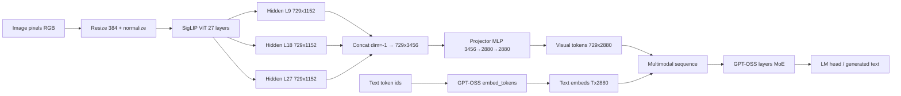

# KC-001 — Vision Architecture

## Target reproduction (community GPT-OSS-20B-Vision / PseudoDeepStack)

Primary public reference:

- https://huggingface.co/vincentkaufmann/gpt-oss-20b-vision-preview  
- Encoder: `google/siglip-so400m-patch14-384` (frozen)  
- LM: GPT-OSS-20B MoE, hidden size **2880**  
- Adaptation claim: QLoRA required; projector-only fails on MoE  

KC-001 reconstructs this path in code (`kc001/src/cobra_kc001/`) and validates it on a tiny MoE surrogate when 20B weights do not fit local VRAM.

---

## Tensor path

---

## Boundary table

| Stage | Input shape | Output shape | dtype | device | trainable (typical) | notes |
|-------|-------------|--------------|-------|--------|---------------------|-------|
| Preprocess | PIL / bytes | `[B,3,384,384]` | fp32 | CPU/GPU | n/a | mean/std 0.5 |
| SigLIP | `[B,3,384,384]` | hidden_states[l]: `[B,729,1152]` | fp32/bf16 | CPU or GPU | **frozen** | patch 14; 27 layers |
| PseudoDeepStack | 3×`[B,729,1152]` | `[B,729,3456]` | same | same | n/a | layers 9,18,27 |
| Projector | `[B,729,3456]` | `[B,729,2880]` | bf16/fp32 | GPU | **trainable** | GELU MLP |
| Text embed | `[B,T]` ids | `[B,T,2880]` | model dtype | GPU | optional LoRA | vocab 201088 |
| Sequence (prepend) | vis+text | `[B,729+T,2880]` | model dtype | GPU | n/a | image labels = -100 |
| GPT-OSS block | `[B,S,2880]` | `[B,S,2880]` | model dtype | GPU | LoRA / router | 4-of-32 experts |
| LM head | `[B,S,2880]` | `[B,S,201088]` | model dtype | GPU | usually frozen in QLoRA | |

---

## Integration modes

### A. Prepend (upstream preview)

`inputs_embeds = cat([visual_tokens, text_embeds], dim=1)`  
Attention mask all-ones; position ids `0..S-1`.  
Used by the public Kaufmann usage snippet.

### B. Placeholder replacement (preferred for SFT hygiene)

Insert `IMAGE_PAD` token ids; scatter visual tokens into those positions; mask labels on pads.  
Implemented in `cobra_kc001.integration.replace_image_pad_embeddings` with hard asserts.

---

## Special tokens / masks

| Concern | Policy |
|---------|--------|
| Image pad token | `<|image_pad|>` (registered when using tokenizer path) |
| Labels on image positions | Must be `-100` |
| Text-only prompts | Must not receive image embeds |
| Context overflow | Assert `S <= max_position_embeddings` (practical window may be smaller) |
| KV cache | Generation with `inputs_embeds` must not assume cache aligned to text-only positions |

---

## KC-001 surrogate

`CobraTinyVisionLM` uses:

- stub PseudoDeepStack encoder (same token count / concat pattern)  
- projector sized to tiny hidden size  
- Tiny MoE LM (8 experts, top-2)  

This proves the **native path** definition without claiming full-weight quality.

---

## What is NOT claimed yet

- Production-quality OCR / chart / document VQA on real GPT-OSS-20B  
- Official OpenAI multimodal GPT-OSS (does not exist; GPT-OSS is text-only upstream)  
- Deployment into askcobra.ai routing  
