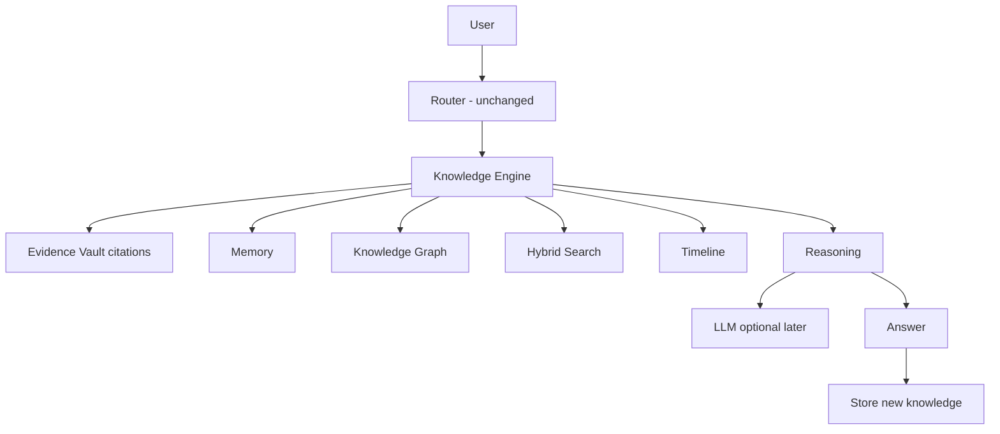

# KC-003 — Cobra Knowledge Engine Architecture

## Mission

Persistent, structured, citation-backed knowledge across projects — **not** a standalone RAG chatbot.

## Flow

## Package

`cobra/` (`@cobra-core/knowledge-engine`) — additive TypeScript library.

- In-memory store for validation
- D1 SQL migrations in `cobra/migrations/001_cke_schema.sql`
- HTTP facade `CkeApi` mountable at `/api/cke/*` later
- **Does not modify** Cobra Computer chat routing or Benchmark Lab

## Modules

| Path | Role |
|------|------|
| `memory/` | Session/project/org/research/long-term/user memory |
| `entity/` | Extraction + upsert |
| `relationship/` | Typed edges |
| `graph/` | Traversal with ACL + depth |
| `timeline/` | Chronological events |
| `search/` | Hybrid keyword/graph/recency/authority |
| `citations/` | Evidence Vault refs (no invention) |
| `reasoning/` | Investigate pipeline |
| `knowledge/` | Facade + decisions + conflicts |
| `permissions/` | Deny-by-default ACL |
| `api/` | REST + streaming investigate |
| `jobs/` | Background maintenance |
| `observability/` | Metrics snapshot |
