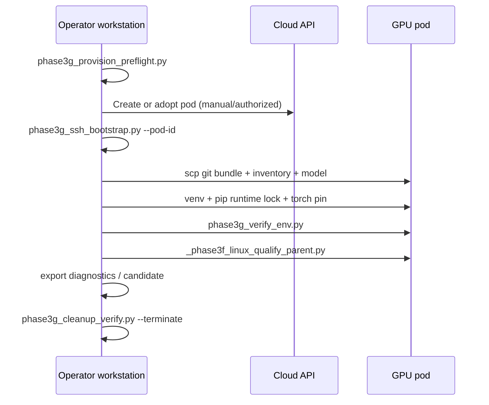

# Cloud execution workflow

Operator path for an authorized single-GPU session on RunPod Community Cloud (or equivalent provider after DR re-auth).

## Preconditions

1. Written authorization (`evaluations/cloud/authorization-record.json` or equivalent) with `authorized: true`
2. Spending ceiling respected (Phase 3F: **$10**)
3. One active GPU instance max; on-demand only
4. Image pin preferred: `evaluations/environments/cloud-qwen3-runtime/container-image-pin.json`
5. Model + repo + venv on **`/workspace`** (or network volume), not overlay `/`

## Sequence



## Storage layout (pod)

```
/workspace/
  transfer/          # bundle, inventory JSON
  models/qwen3-8b/   # weights (~15 GB)
  cobra-core-cloud/  # git clone from bundle
    .venv-qwen-cloud/
```

Overlay root (~30 GB on Phase 3F template) is **insufficient** for model + venv.

## Transfer rules

- Prefer SSH/`scp` of git bundle and model tarball
- No public buckets for weights or private bundles
- Never print `RUNPOD_API_KEY` or private key material

## Cost posture

| Item | Phase 3F measured |
| --- | --- |
| GPU | A40 @ $0.44/hr |
| Duration | ~3.14 h |
| Estimated spend | ~$1.38 |
| Ceiling | $10 respected |

P1 ops target: reduce avoidable setup time (~$0.22/session at $0.44/hr). SKU right-sizing is documentation-only until abbreviated smoke on the new SKU.

## Forbidden during execution

- Second concurrent GPU pod
- Spot/interruptible without re-auth
- Public Jupyter or inference endpoint
- Training / LoRA
- CobraBench (unless a later phase explicitly authorizes it)
