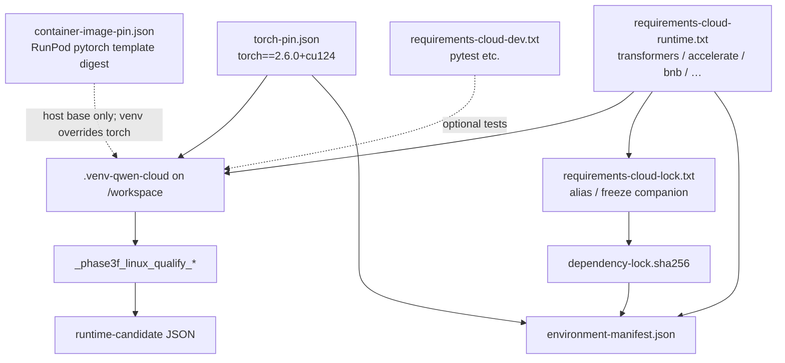

# Dependency relationship diagram

Pinned cloud runtime stack for Phase 3F equivalence. **Do not upgrade versions in Phase 3G.5** (docs-only phase).

## Relationship map



## Runtime vs development

| File | Install when | Includes pytest? |
| --- | --- | --- |
| `requirements-cloud-runtime.txt` | Always for qualification | No |
| `requirements-cloud-dev.txt` | Optional local/pod tests | Yes |
| `requirements-cloud-lock.txt` | Companion lock alias | Matches freeze discipline |

## Critical pins (qualified)

| Component | Version |
| --- | --- |
| Python | 3.12.x (3.11 OK; not 3.13) |
| torch | `2.6.0+cu124` (official cu124 index) |
| transformers | 5.14.1 |
| accelerate | 1.14.0 |
| bitsandbytes | 0.49.2 |
| huggingface-hub | 1.24.0 (required by transformers ≥1.5.0) |

## Change impact

| Change | Requalification |
| --- | --- |
| Docs / ops scripts only | None |
| Same versions, re-hash locks | Hash verify |
| Any runtime version bump | Full 6-load smoke |
| Quant / device_map / model revision | Full requal + treat as behavior-sensitive |
| GPU SKU only | Abbreviated smoke recommended |

## Integrity check

```bash
python scripts/phase3g_verify_env.py
```

Must pass before treating a pod as qualification-ready.
