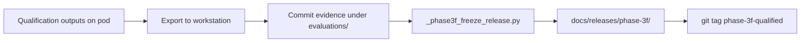

# Evidence generation workflow

How qualification and ops evidence become auditable artifacts without mutating inference behavior.

## Artifact classes

| Class | Example location | Contents |
| --- | --- | --- |
| Attempt diagnostics | `evaluations/diagnostics/.../attempts/*` | Per-gate attempt/result JSON |
| Environment snapshot | `environment.json`, `native-backend-validation.json` | Host/python/CUDA pins |
| Qualification summary | `qualification_summary.json`, `OUTCOME.json` | Aggregate pass/fail |
| Runtime candidate | `evaluations/runtime-candidates/qwen3-8b-cloud-linux-qualified.json` | Locked qualified config |
| Cloud records | `evaluations/cloud/` or release `cloud/` | cost, cleanup, auth (redacted) |
| Freeze package | `docs/releases/phase-3f/` | Manifest, SHA256SUMS, notes |
| Ops evidence | `evaluations/diagnostics/phase-3g-p1/` | P1 task ledger + hashes |

## Phase 3F freeze path



Freeze package includes:

- `EVIDENCE_MANIFEST.json`
- `SHA256SUMS`
- `RELEASE_NOTES_Phase3F.md`
- `PHASE_3F_RELEASE_REPORT.md`
- Copied diagnostics, candidate, cloud records, protocol status

## Phase 3G P1 evidence path

```bash
python scripts/phase3g_write_p1_evidence.py
# → evaluations/diagnostics/phase-3g-p1/{SUMMARY,TASKS,integrity-check}.json
```

Integrity fields must show:

- `benchmark_executed: false`
- `prepared_protocol_status: prepared-not-run`
- `official_v01_score_unchanged: 0.84`
- `runtime_requalification_required: false` (for ops-only P1)

## Hashing rules

1. Prefer SHA-256 of canonical file bytes.
2. Model identity is the **inventory hash**, not filenames alone.
3. Dependency identity is `dependency-lock.sha256` + runtime requirements + `torch-pin.json`.
4. Do not rewrite historical attempt JSON after freeze except via a new phase with a new commit.

## What evidence is not

- Not a deployment approval
- Not an official CobraBench score update
- Not proof that every GPU SKU works (see GPU compatibility matrix)
