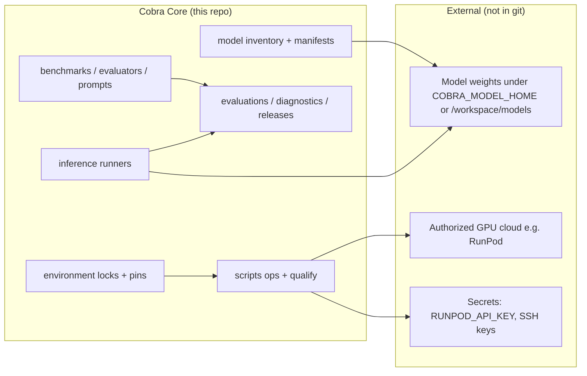

# Cobra Core — overall architecture

**Scope:** Model research lab (intake, benchmarks, evaluation, runtime qualification).  
**Out of scope:** Cobra Investigator UI, auth, billing, Evidence Vault, production chat endpoints.

## System context

## Repository layers

| Layer | Paths | Role |
| --- | --- | --- |
| Package | `src/cobra_core/` | Schemas, CLI, provider interfaces |
| Benchmarks | `benchmarks/`, `evaluators/`, `prompts/`, `runtime_policies/` | CobraBench cases and scoring |
| Inference | `inference/`, provider notes under `providers/` | Provider-neutral runners |
| Environments | `evaluations/environments/*` | OS-specific locks, pins, runbooks |
| Evidence | `evaluations/diagnostics/`, `evaluations/runtime-candidates/`, `docs/releases/` | Qualification and freeze packages |
| Ops scripts | `scripts/phase3g_*.py`, `scripts/_phase3f_*.py` | Cloud bootstrap, qualify, cleanup, freeze |
| Training | `training/` | Guarded; not authorized |

## Qualified cloud runtime (Phase 3F)

| Item | Value |
| --- | --- |
| Tag | `phase-3f-qualified` |
| Commit | `0a2af49ee86451c374a600579d3644c811cd12c0` |
| Candidate | `evaluations/runtime-candidates/qwen3-8b-cloud-linux-qualified.json` |
| Model | Qwen3-8B @ `b968826d9c46dd6066d109eabc6255188de91218` |
| Inventory hash | `8cf07aa84c9e26c9dd4ce71b21bd498232c8dfa5afe5284d375be0c1e9bb3f4f` |
| Quant path | bitsandbytes 4-bit NF4, double quant, float16, `device_map={"": 0}` |
| Stack | Python 3.12.3, torch `2.6.0+cu124`, transformers 5.14.1, accelerate 1.14.0, bitsandbytes 0.49.2 |
| Bench state | CobraBench v0.2-rc2 `prepared-not-run`; official v0.1 score **0.840** |

## Integrity invariants

1. Weights never live in git.
2. Official scores never silently change.
3. Runtime candidate ≠ production deployment authorization.
4. Smoke qualification ≠ CobraBench execution.
5. Secrets stay in environment / local gitignored files only.

## Related packages

- Operations: `docs/operations/`
- Disaster recovery: `docs/disaster-recovery/`
- Security review: `docs/security/SECURITY_REVIEW.md`
- GPU matrix: `docs/runtime/GPU_COMPATIBILITY.md`
