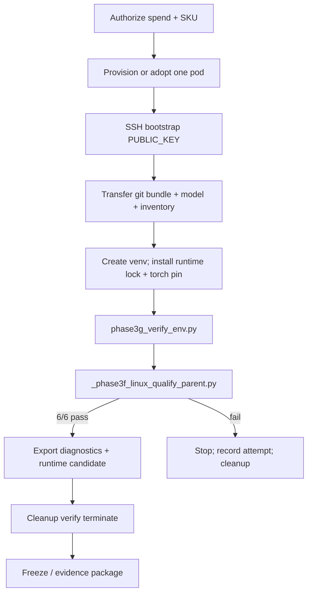

# Runtime qualification workflow

Reproduces the **Phase 3F Outcome A** smoke qualification on authorized Linux CUDA hosts. Synthetic prompts only; **no CobraBench**.

## Gates (must all pass)

| # | Gate | Success criteria |
| --- | ---: | --- |
| 0 | Native backend | CUDA + bitsandbytes import/load path healthy |
| 1 | Initial full load | Model loads on GPU 0 with pinned quant/device_map |
| 2 | Initial generation | Short synthetic generate succeeds |
| 3–5 | Fresh-process qual ×3 | Three independent process loads + generates |
| 6 | Extended session | Multi-prompt session without crash |
| Budget | Full loads | ≤ 6 full model loads for the session |

Peak VRAM under Phase 3F: **~5.88–6.32 GiB**.

## Control flow

## Primary scripts

| Script | Role |
| --- | --- |
| `scripts/phase3g_provision_preflight.py` | Pre-spend gates (does not create pods) |
| `scripts/phase3g_ssh_bootstrap.py` | Ensure SSH `PUBLIC_KEY`; verify TCP SSH |
| `scripts/phase3g_verify_env.py` | Confirm pins/versions match lock |
| `scripts/_phase3f_linux_qualify_parent.py` | Orchestrate worker attempts |
| `scripts/_phase3f_linux_qualify_worker.py` | Single-process load/generate |
| `scripts/phase3g_cleanup_verify.py` | Terminate + remaining-resource audit |
| `scripts/_phase3f_freeze_release.py` | Build `docs/releases/phase-3f/` style freeze |

## Environment variables (qualification)

| Variable | Purpose |
| --- | --- |
| `COBRA_CLOUD_MODEL_DIR` | Path to model weights (e.g. `/workspace/models/qwen3-8b`) |
| `COBRA_CLOUD_INVENTORY` | Path to inventory JSON matching hash `8cf07aa8…` |
| `RUNPOD_API_KEY` | Operator workstation only; never commit |

## Outcomes

| Outcome | Meaning |
| --- | --- |
| A | Fully qualified (all gates) |
| Non-A | Stop; do not invent a candidate; cleanup |

## Explicit non-goals

- Running CobraBench
- Changing quant/device_map/prompts/model revision
- Multi-pod or public endpoints
- Designating “Cobra Core” production model
